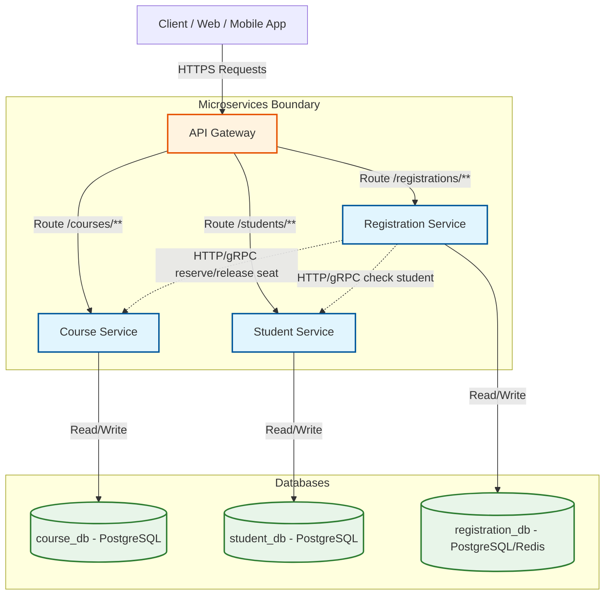

# Thiết Kế Biên Giới Dịch Vụ (Service Boundary Design) - Course Registration System (CRS)

Tài liệu này mô tả chi tiết thiết kế hệ thống đăng ký môn học (Course Registration System - CRS) theo kiến trúc Microservices, bao gồm 4 thành phần cốt lõi, thiết kế cơ sở dữ liệu riêng biệt cho từng dịch vụ và bảng định tuyến của API Gateway.

---

## 1. Sơ Đồ Kiến Trúc Hệ Thống (Architecture Overview)

Dưới đây là sơ đồ thể hiện biên giới các dịch vụ, cơ sở dữ liệu riêng biệt và luồng tương tác giữa các thành phần thông qua API Gateway:



---

## 2. Mô Tả Chi Tiết 4 Thành Phần Hệ Thống

Hệ thống được chia thành **4 thành phần chính** với trách nhiệm và biên giới dữ liệu rõ ràng:

### 2.1. API Gateway (Cổng Kết Nối Hệ Thống)
* **Vai trò:** 
  * Là điểm đầu mối duy nhất tiếp nhận mọi yêu cầu từ Client.
  * Chịu trách nhiệm định tuyến (Routing) yêu cầu tới các microservices tương ứng phía sau.
  * Thực hiện xác thực (Authentication), phân quyền (Authorization) tập trung bằng JWT.
  * Giới hạn tần suất gọi (Rate Limiting) để bảo vệ hệ thống khỏi tấn công DDoS hoặc quá tải khi sinh viên đăng ký dồn dập.

### 2.2. Course Service (Dịch vụ Môn học & Lớp học)
* **Vai trò:**
  * Quản lý thông tin môn học (Mã môn, tên môn, số tín chỉ, môn tiên quyết).
  * Quản lý các lớp học phần được mở trong học kỳ (Thời gian, giảng viên, phòng học, giới hạn số chỗ).
  * Kiểm soát số lượng chỗ ngồi thực tế của lớp học. Cung cấp API nội bộ phục vụ việc **giữ chỗ (`reserve-seat`)** và **nhả chỗ (`release-seat`)**.
* **Cơ sở dữ liệu riêng:** `course_db` (PostgreSQL)

### 2.3. Student Service (Dịch vụ Sinh viên)
* **Vai trò:**
  * Quản lý thông tin cá nhân của sinh viên (Họ tên, mã sinh viên, trạng thái học tập).
  * Quản lý tiến trình học tập, bảng điểm, và danh sách các môn học sinh viên đã hoàn thành (phục vụ việc kiểm tra điều kiện môn tiên quyết).
  * Kiểm tra trạng thái học phí (Sinh viên nợ học phí có thể bị chặn đăng ký).
* **Cơ sở dữ liệu riêng:** `student_db` (PostgreSQL)

### 2.4. Registration Service (Dịch vụ Đăng ký học phần)
* **Vai trò:**
  * Tiếp nhận và xử lý các yêu cầu đăng ký/hủy đăng ký học phần của sinh viên.
  * Đóng vai trò là Bộ điều phối giao dịch (Orchestrator). Khi sinh viên nhấn đăng ký, dịch vụ này sẽ thực hiện quy trình nghiệp vụ:
    1. Kiểm tra điều kiện sinh viên (gọi sang Student Service).
    2. Yêu cầu giữ chỗ tạm thời (gọi sang Course Service qua API `/internal/courses/{id}/reserve-seat`).
    3. Ghi nhận đăng ký thành công nếu giữ chỗ thành công.
    4. Rollback (nhả chỗ qua `/internal/courses/{id}/release-seat`) nếu quy trình gặp lỗi hoặc sinh viên hủy đăng ký.
* **Cơ sở dữ liệu riêng:** `registration_db` (PostgreSQL hoặc Redis để tối ưu hóa hàng đợi đăng ký với lượng truy cập lớn).

---

## 3. Thiết Kế Cơ Sở Dữ Liệu Riêng Biệt (Database Schema per Service)

Để đảm bảo tính độc lập và khả năng mở rộng (high scalability), mỗi dịch vụ quản lý cơ sở dữ liệu riêng của mình, không thực hiện `JOIN` chéo database ở mức SQL.

### 3.1. Dịch vụ Môn học (`course_db`)
### 3.2. Dịch vụ Sinh viên (`student_db`)
### 3.3. Dịch vụ Đăng ký học phần (`registration_db`)
```sql
-- Bảng lưu vết lịch sử đăng ký học phần
CREATE TABLE registrations (
    id SERIAL PRIMARY KEY,
    student_code VARCHAR(20) NOT NULL,    -- Tham chiếu logic (không khóa ngoại vật lý)
    section_code VARCHAR(20) NOT NULL,    -- Tham chiếu logic
    registered_at TIMESTAMP DEFAULT CURRENT_TIMESTAMP,
    status VARCHAR(20) NOT NULL           -- 'SUCCESS', 'FAILED', 'CANCELLED'
);
```

---

## 4. Bảng Định Tuyến Của API Gateway Dự Kiến (Gateway Routing Table)

API Gateway sẽ lắng nghe ở một cổng duy nhất (ví dụ: `8080` hoặc `8000`) và chuyển tiếp các yêu cầu dựa trên tiền tố đường dẫn (path prefix):

| Khớp Đường Dẫn (Route Pattern) | Dịch Vụ Đích (Target Service) | Địa Chỉ Nội Bộ (Internal URL) | Các Nghiệp Vụ Chính |
|:---|:---|:---|:---|
| `/courses/**` | `course-service` | `http://course-service:8081` | Xem danh sách môn học, chi tiết lớp học phần |
| `/students/**` | `student-service` | `http://student-service:8082` | Tra cứu hồ sơ sinh viên, xem điểm số |
| `/registrations/**` | `registration-service` | `http://registration-service:8083` | Sinh viên đăng ký lớp học phần, hủy đăng ký |

> [!IMPORTANT]  
> Các API nội bộ giữa các service (như `reserve-seat`, `release-seat`) **không được khai báo** trong bảng định tuyến của Gateway để tránh việc Client tự ý gọi phá hoại. Chúng chỉ được gọi trực tiếp giữa các Service thông qua mạng nội bộ của cụm (Cluster Network/Kubernetes DNS/Eureka).
