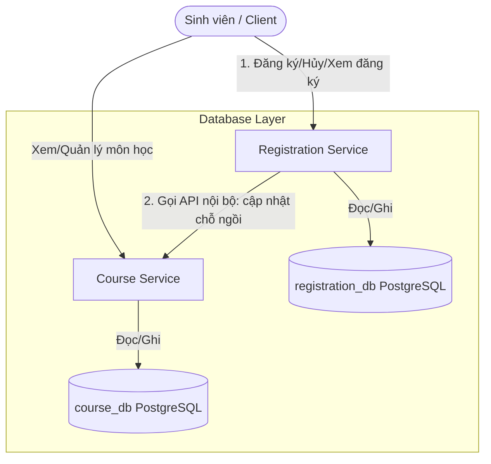

# Thiết Kế Biên Giới Dịch Vụ (Service Boundary Design) - Course Registration System (CRS)

Tài liệu này mô tả thiết kế biên giới dịch vụ của dự án đăng ký môn học CRS ở thời điểm hiện tại.

---

## 1. Trạng Thế Triển Khai Hiện Tại

Hiện tại, hệ thống đã triển khai hai dịch vụ chính:
* **Course Service (Dịch vụ Môn học)**: Đóng vai trò quản lý thông tin các môn học, tín chỉ và sĩ số chỗ ngồi.
* **Registration Service (Dịch vụ Đăng ký)**: Quản lý các lượt đăng ký môn học của sinh viên, giao tiếp với `Course Service` để cập nhật số lượng chỗ ngồi còn lại khi sinh viên thực hiện đăng ký hoặc hủy đăng ký môn học.

---

## 2. Thiết Kế Cơ Sở Dữ Liệu Hiện Tại

Để đảm bảo tính độc lập, mỗi service sở hữu cơ sở dữ liệu riêng:

### 2.1. Cơ sở dữ liệu Course Service
* **Tên Database**: `course_db`
* **Hệ quản trị**: PostgreSQL
* **Bảng dữ liệu**: Bảng `course` quản lý các thông tin:
  * `id` (Khóa chính)
  * `ten_mon_hoc` (Tên môn học)
  * `so_tin_chi` (Số tín chỉ)
  * `so_cho_toi_da` (Số chỗ tối đa)
  * `so_cho_con_lai` (Số chỗ còn lại)

### 2.2. Cơ sở dữ liệu Registration Service
* **Tên Database**: `registration_db`
* **Hệ quản trị**: PostgreSQL
* **Bảng dữ liệu**: Bảng `registration` quản lý các thông tin:
  * `id` (Khóa chính, Identity)
  * `student_id` (ID của sinh viên đăng ký)
  * `course_id` (ID của môn học)
  * `trang_thai` (Trạng thái đăng ký: `DA_DANG_KY`, `DA_HUY`)
  * `ngay_dang_ky` (Thời gian ghi nhận đăng ký)