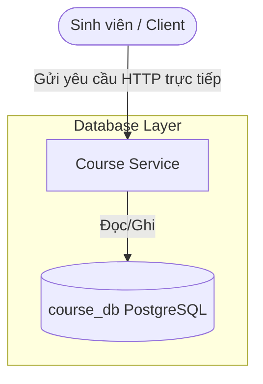

# Thiết Kế Biên Giới Dịch Vụ (Service Boundary Design) - Course Registration System (CRS)

Tài liệu này mô tả thiết kế biên giới dịch vụ của dự án đăng ký môn học CRS ở thời điểm hiện tại.

---

## 1. Trạng Thái Triển Khai Hiện Tại

Hiện tại, hệ thống mới chỉ triển khai một dịch vụ duy nhất:
* **Course Service (Dịch vụ Môn học)**: Đóng vai trò quản lý thông tin các môn học, tín chỉ và sĩ số chỗ ngồi.

Các thành phần khác bao gồm API Gateway, Student Service và Registration Service đang ở giai đoạn lên kế hoạch phát triển và chưa có mã nguồn thực tế trong dự án.

---

## 2. Thiết Kế Cơ Sở Dữ Liệu Hiện Tại

Dịch vụ duy nhất đang chạy sở hữu cơ sở dữ liệu riêng:

* **Tên Database**: `course_db`
* **Hệ quản trị**: PostgreSQL
* **Bảng dữ liệu**: Bảng `course` quản lý các thông tin:
  * `id` (Khóa chính)
  * `ten_mon_hoc` (Tên môn học)
  * `so_tin_chi` (Số tín chỉ)
  * `so_cho_toi_da` (Số chỗ tối đa)
  * `so_cho_con_lai` (Số chỗ còn lại)