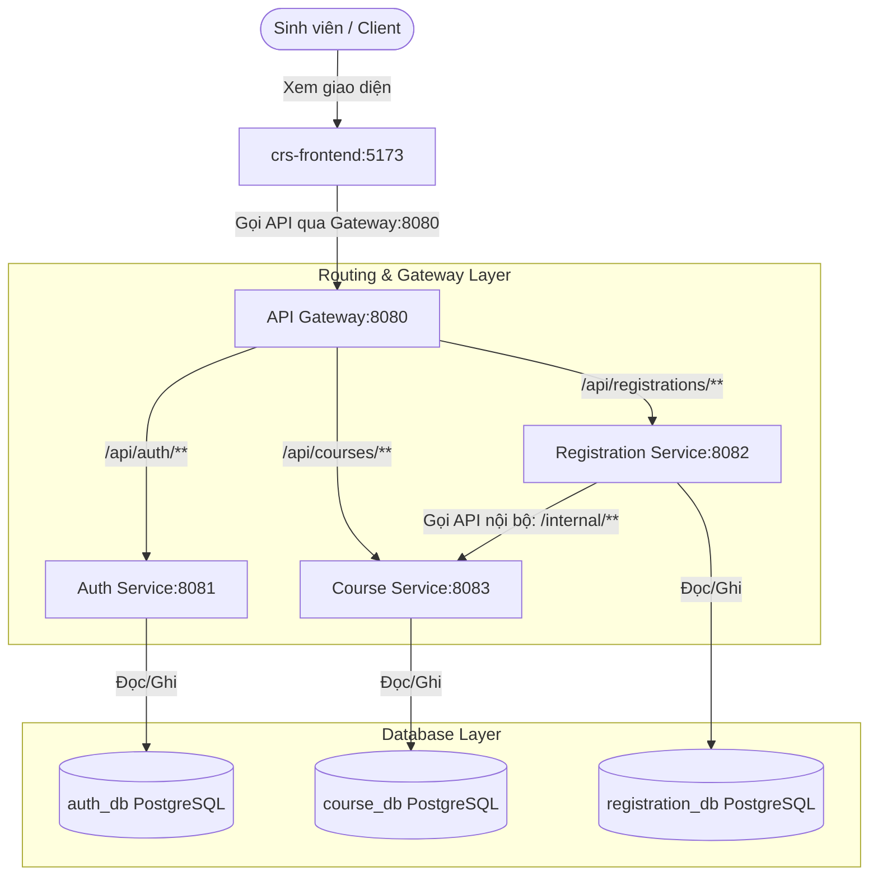

# Thiết Kế Biên Giới Dịch Vụ (Service Boundary Design) - Course Registration System (CRS)

Tài liệu này mô tả thiết kế biên giới dịch vụ, kiến trúc bảo mật và cơ chế xử lý trạng thái phía Client/Server của hệ thống đăng ký môn học CRS.

---

## 1. Trạng Thái Triển Khai Hiện Tại

Hệ thống được thiết kế theo kiến trúc Microservices gồm các thành phần sau:
* **crs-frontend**: Ứng dụng giao diện người dùng (chạy trên cổng `5173` bằng React + Vite + TypeScript).
* **API Gateway**: Cửa ngõ duy nhất (cổng `8080`), chịu trách nhiệm định tuyến các request từ Frontend và lọc xác thực sơ bộ.
* **Auth Service (Dịch vụ Xác thực)**: Quản lý thông tin tài khoản người dùng, sinh viên và cấp phát JWT token (cổng `8081`).
* **Course Service (Dịch vụ Môn học)**: Quản lý thông tin các môn học, tín chỉ và sĩ số chỗ ngồi (cổng `8083`).
* **Registration Service (Dịch vụ Đăng ký)**: Quản lý các lượt đăng ký môn học của sinh viên, giao tiếp nội bộ với `Course Service` để trừ/khôi phục chỗ ngồi (cổng `8082`).

---

## 2. Thiết Kế Cơ Sở Dữ Liệu Hiện Tại

Mỗi microservice sở hữu cơ sở dữ liệu riêng để đảm bảo tính độc lập:

### 2.1. Cơ sở dữ liệu Auth Service
* **Tên Database**: `auth_db`
* **Hệ quản trị**: PostgreSQL
* **Bảng dữ liệu**:
  * `app_user`: Lưu trữ thông tin tài khoản (`id`, `username`, `password` đã mã hóa, `role` - `ADMIN`/`STUDENT`).
  * `student`: Lưu thông tin sinh viên liên kết với tài khoản (`id`, `ho_ten`, `masv`, `user_id` liên kết `app_user`).

### 2.2. Cơ sở dữ liệu Course Service
* **Tên Database**: `course_db`
* **Bảng dữ liệu**: `course` quản lý thông tin môn học (`id`, `ten_mon_hoc`, `so_tin_chi`, `so_cho_toi_da`, `so_cho_con_lai`).

### 2.3. Cơ sở dữ liệu Registration Service
* **Tên Database**: `registration_db`
* **Bảng dữ liệu**: `registration` quản lý thông tin lượt đăng ký (`id`, `student_id`, `course_id`, `trang_thai` - `DA_DANG_KY`/`DA_HUY`, `ngay_dang_ky`).

---

## 3. Luồng Xác Thực và Bảo Mật (Security & Authentication Flow)

Hệ thống bảo mật bằng cơ chế **JWT (JSON Web Token)** được quản lý xuyên suốt qua các lớp từ Gateway, Microservices đến Frontend:

### 3.1. Lọc tại API Gateway (`AuthHeaderFilter`)
* **Chặn request không có token:** API Gateway sẽ chặn ngay lập tức và trả về `401 Unauthorized` đối với các endpoint bảo mật nếu request không gửi kèm Header `Authorization: Bearer <JWT>`.
* **Mở các đường dẫn công khai (Public Paths):**
  * Đăng nhập: `/api/auth/login`
  * Xem danh sách môn học công khai: `/api/public/courses`
  * Các request đọc dữ liệu môn học: `GET /api/courses` và `GET /api/courses/**`

### 3.2. Xác thực và Phân quyền tại từng Microservice
Khi request hợp lệ đi qua Gateway, Token sẽ được chuyển tiếp tới service đích. Tại đây:
1. `JwtAuthFilter` của service đích trích xuất Token từ header `Authorization`.
   * **Nếu Token không hợp lệ / bị sửa đổi / đã hết hạn:** Filter ngắt request ngay lập tức và phản hồi mã lỗi `401 Unauthorized` kèm JSON `{"message": "Token không hợp lệ hoặc đã hết hạn."}`.
2. `SecurityConfig` thực hiện phân quyền dựa trên `role`:
   * **Course Service:**
     * `GET /courses`, `GET /courses/**` -> Công khai cho tất cả mọi người (`permitAll()`).
     * `POST /courses`, `PUT /courses`, `DELETE /courses` (và subpaths `/**`) -> Yêu cầu tài khoản có quyền `ROLE_ADMIN`.
     * `/internal/**` -> Chỉ cho phép gọi nội bộ giữa các service (Bypass Security).
   * **Registration Service:**
     * `/registrations`, `/registrations/**` -> Yêu cầu tài khoản đã đăng nhập (`authenticated()`).

### 3.3. Xử lý Trạng Thái & Tự Động Đăng Xuất ở Frontend (`crs-frontend`)
* **Khởi tạo trạng thái đồng bộ (`AuthContext`)**: Đọc thông tin người dùng từ `localStorage` ngay khi khởi tạo State để tránh việc trang bị đẩy về `/login` bất ngờ khi người dùng F5 / reload lại trang.
* **Tự động đăng xuất với Axios Interceptor (`axiosClient.ts`)**: 
  * Khi bất kỳ request nào trả về mã lỗi `401 Unauthorized` (do token hết hạn hoặc bị sửa đổi trái phép trên trình duyệt), Interceptor sẽ lập tức xóa `crs_token` và `crs_user` khỏi `localStorage` và tự động chuyển hướng người dùng về trang `/login`.